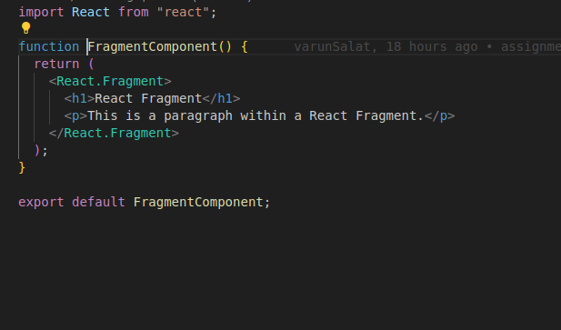

In this assignment, we created a simple ReactJS frontend application that demonstrates the use of conditional rendering using useState, use of fragments, react-portals and animations using CSSTransition using CSSTransition from the react-transition-group on the paragraph tag.

Steps to Build the Application:

Step 1: Setting Up the Project

Create a New React App: npx create-react-app my-assignment-4

cd my-assignment-4

Step 2: Install react-transition-group

npm install react-transition-group

Step 3: Tasks which are asked

1. Conditional rendering of content using "useState"

Here, we have created useState named showMessage initially it's value it set to false.
When we click on button we are changing it's value from false to true.
using this condition we are changing the color or button and also showing the paragraph.

2. React Fragment

React fragment is used to combine the child nodes and render without creating an extra parent Node.
We have created h1 tag and p tag without any parent tag.

3. React Portals using DOM

React portal is used to flexibly render the children of a React component in another location in the DOM.
We have rendered the component in the App file.

here is the PortalComponent:

4. Animation using CSSTransition

React Transition Group is a collection of components that work together to enable smooth transitions.

We have created animation on the click of button using inProp useState.
When we are clicking on Click to show button the animation is starting.

Step 4: Integrating these component in the App.js file.

After completing all tasks in a component we have put it in the App.js and showed in grid formate for better UI.

